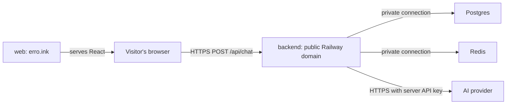

# Railway setup

Use the existing Railway project and the same environment as `web`. The target
is four services: `web`, `backend`, `Postgres`, and `Redis`. These names are used
exactly in the variable references below; adjust references if services have
different names. MinIO stays local. Amazon S3 can be connected later.

This guide records the required deployment configuration. No Railway resources
have been created or inspected from this workspace. The dashboard labels below
follow Railway's documentation checked on 2026-10-03.



The browser calls the backend directly, so the backend needs a public HTTPS
domain. Database connections use Railway's private network. Chat does not write
to PostgreSQL or Redis; both are connected and checked for future work.

## 1. Put the code on the deployment branch

Commit the backend, chat frontend, and configuration changes, then merge/push
them to GitHub `main`. The existing web service deploys from `main`; the new
backend service must use the same branch. Do not commit `.env` or real API keys.

Keep root `compose.yaml` for local development. This guide adds services in the
Railway dashboard so the existing web service and domain remain in place.

## 2. Add PostgreSQL and Redis

In the existing project/environment, use **+ New → Database → Add PostgreSQL**
and repeat for **Redis**. Name the services `Postgres` and `Redis`. Deploy staged
changes and wait for both to start. Keep their generated credentials, startup
commands, and persistent volumes. Select the same region as the backend.

PostgreSQL must be major **18**, matching the project's chosen major. Check the
running version in its database view or logs; do not assume `latest` means 18.
If the template starts on 16 or 17, use **Database → Config → Major Version
Upgrade**, choose 18, review preflight, and run the upgrade. This requires the
official `ghcr.io/railwayapp-templates/postgres-ssl` image and a pinned source
major. If its source tag is `latest`, first change that tag to the **currently
running major**, deploy, and then use the upgrade flow. Do not jump an initialized
data volume to a different major by editing its image tag. See Railway's
[PostgreSQL major upgrade instructions](https://docs.railway.com/databases/postgresql-major-upgrade).

For the new Redis service, use the project's tested image
`redis:8.10.1-alpine` in its source image settings, retaining the template's
password-aware start command and `/data` volume. Inspect the resolved start
command to ensure password authentication remains enabled. This is a new empty
service setup, not an instruction to downgrade an existing database.

The templates supply database credentials and connection variables. Nothing
from local `.env` needs copying onto these services. Public database domains and
TCP proxies are unnecessary for backend access. Railway documents the provided
variables in its [PostgreSQL](https://docs.railway.com/databases/postgresql) and
[Redis](https://docs.railway.com/databases/redis) guides. Services must share a
project and environment for [private networking](https://docs.railway.com/networking/private-networking).

## 3. Add the backend service

Add an empty service, name it `backend`, and configure it before deploying. Under
**Settings**, connect the GitHub repository `blueye51/Erro`, select branch `main`,
and set these values:

| Setting | Value |
| --- | --- |
| Root Directory | `/backend` |
| Builder | Detected Dockerfile (`backend/Dockerfile` in the repository) |
| Build Command override | Empty; the Dockerfile runs Maven `verify`. |
| Start Command override | Empty; the Dockerfile starts the Java application. |
| Pre-deploy Command | Empty; there are no migrations. |
| Healthcheck Path | Empty; no GET health endpoint exists. |

An automatic deployment triggered before configuration is complete may fail;
apply all settings and variables, then deploy again. The root directory makes
the Docker build context `backend/`; do not use the repository root as its context.
See Railway's [monorepo](https://docs.railway.com/deployments/monorepo) and
[Dockerfile](https://docs.railway.com/builds/dockerfiles) instructions.

The Dockerfile uses ordinary dependency-layer caching. It does not require
Railway-specific BuildKit cache mount IDs or AI/database credentials at build
time. Do not add build arguments containing secrets.

## 4. Configure backend variables

In **backend → Variables → Raw Editor**, merge these settings into the existing
variables. The `${{...}}` expressions are Railway references, not values to
manually expand. Paste this in the dashboard, not into a shell or local `.env`.

```dotenv
PORT=8080
DATABASE_URL=jdbc:postgresql://${{Postgres.RAILWAY_PRIVATE_DOMAIN}}:${{Postgres.PGPORT}}/${{Postgres.PGDATABASE}}?sslmode=require
DATABASE_USERNAME=${{Postgres.PGUSER}}
DATABASE_PASSWORD=${{Postgres.PGPASSWORD}}
REDIS_HOST=${{Redis.RAILWAY_PRIVATE_DOMAIN}}
REDIS_PORT=${{Redis.REDISPORT}}
REDIS_PASSWORD=${{Redis.REDISPASSWORD}}
SPRING_DATA_REDIS_USERNAME=${{Redis.REDISUSER}}
S3_ENABLED=false
INFRASTRUCTURE_VERIFY_ON_STARTUP=true
CHAT_ALLOWED_ORIGINS=https://erro.ink
AI_ENDPOINT=https://api.openai.com/v1/responses
AI_MODEL=gpt-5.4-mini
AI_MAX_OUTPUT_TOKENS=2048
AI_TIMEOUT=60s
```

Add `AI_API_KEY` separately with your real provider API key. It belongs on
`backend` only. Without it, the backend still starts but chat returns
`AI chat is not configured yet.` The model must be available to that account.
The adapter expects the Responses API schema; changing the endpoint alone does
not adapt other API formats. See [Chat configuration](chat.md#configuration).

The JDBC prefix is required by this Java application. Railway's generated
`DATABASE_URL` is usually a `postgresql://` URL and must not be copied directly
into this backend's `DATABASE_URL`. Separate username/password references avoid
embedding credentials in the URL. `sslmode=require` uses TLS with Railway's
official SSL-enabled PostgreSQL image; it does not validate the server
certificate. The connection also stays on Railway's private network. See the
[PostgreSQL JDBC connection format](https://jdbc.postgresql.org/documentation/use/).

`SPRING_DATA_REDIS_USERNAME` is Spring Boot's standard Redis username property;
the default Railway Redis user is supplied by the template's `REDISUSER`.
`S3_ENABLED=false` prevents S3 client creation and skips only the S3 connection
check. No `AWS_*` or MinIO credentials are needed. PostgreSQL and Redis checks
remain enabled; a failed connection stops startup.

If visitors also use the generated web domain or `www.erro.ink`, append their
exact HTTPS origins, separated by commas, to `CHAT_ALLOWED_ORIGINS`. For example:

```dotenv
CHAT_ALLOWED_ORIGINS=https://erro.ink,https://web-example.up.railway.app
```

Replace the example with the actual **web** domain. Origins contain no path or
trailing slash. Only include `www.erro.ink` if that domain is configured and used.
Apply/deploy staged variable changes; editing a variable alone does not update
an existing container. See [Railway variable references](https://docs.railway.com/variables).

## 5. Deploy the backend and give it a domain

Wait until PostgreSQL and Redis are ready, then deploy `backend`. In its runtime
logs, confirm all of:

```text
PostgreSQL connection verified
Redis connection verified
S3 storage disabled; skipping its connection check
Infrastructure ready
```

In **backend → Settings → Networking → Public Networking**, choose **Generate
Domain**. Set the target port to **8080**, matching the backend's `PORT` variable.
Use the resulting `https://...up.railway.app` origin. No Namecheap change is
needed; `erro.ink` continues pointing at `web`.

The backend has no home page. Opening its root in a browser may return 404, and
opening `/api/chat` sends GET and returns 405. Neither tests the POST chat flow.
Do not use `/` or `/api/chat` as a Railway GET healthcheck path.

## 6. Connect the existing web service

In **web → Variables**, set:

```dotenv
VITE_API_BASE_URL=https://${{backend.RAILWAY_PUBLIC_DOMAIN}}
```

This assumes the backend has the generated domain from step 5. Alternatively,
paste its literal HTTPS origin, such as `https://backend-example.up.railway.app`.
Do not append `/api/chat` or `:8080`; the frontend appends the path, and Railway
terminates HTTPS on the public domain. Never use `backend.railway.internal` here:
visitors' browsers cannot reach Railway's private network.

Keep the existing web service's root directory `/web` and build command
`npm run build`. Leave pre-deploy empty. Keep its working Railpack static-site
serving configuration; do not replace it with the local Vite dev server.
**Rebuild and deploy web** after changing `VITE_API_BASE_URL`: Vite embeds it in
the JavaScript bundle during the build. A restart alone does not change it.
`BACKEND_PROXY_TARGET` is a development-server setting and does not route the
production static site. No database passwords or AI key belong in web variables.

## 7. Verify the deployed chat

Open `https://erro.ink`, send a short message, and confirm a formatted reply.
In browser developer tools, Network should show a POST to the backend's HTTPS
`/api/chat` returning 200 with a JSON `reply`. Refreshing should clear the page's
messages. No chat tables, Redis keys, or saved conversations are created.

To isolate backend issues, substitute the actual backend domain in:

```sh
curl -i 'https://YOUR-BACKEND.up.railway.app/api/chat' \
  -H 'Content-Type: application/json' \
  -H 'Origin: https://erro.ink' \
  --data '{"message":"Say hello in one sentence."}'
```

This uses the backend's provider account and makes a real AI request if a key is
configured. No provider key is sent from the browser or curl command. The current
API has no login or application rate limiter, so public requests use that
account; CORS is not authentication.

| Symptom | Check |
| --- | --- |
| Backend exits before `Infrastructure ready` | Check runtime logs, service names in references, ready databases, and `S3_ENABLED=false`. Redeploy after dependencies are available. |
| JDBC URL error | `DATABASE_URL` must start with `jdbc:postgresql://`; do not use the template URL unchanged. |
| Backend 502 / fails to respond | Backend process must be running and both `PORT` and generated domain target port must be 8080. |
| Browser CORS rejection | Add the exact page origin to backend `CHAT_ALLOWED_ORIGINS`, then redeploy backend. |
| POST goes to `erro.ink/api/chat` or returns HTML | Set web `VITE_API_BASE_URL`, then rebuild web. |
| `AI chat is not configured yet.` | Add `AI_API_KEY` on backend and deploy the variable change. |
| Provider rejected / unavailable | Check backend key, account access, configured model, and provider limits. See [chat errors](chat.md#api-contract). |
| Works by curl but not in the page | Check the public URL in the built frontend and CORS; private Railway domains cannot be used by the browser. |

## Local verification of deployment changes

Verified on 2026-10-04:

- `docker compose config --quiet` passed, and the backend Docker image built
  successfully with all 17 Maven tests passing.
- A separate backend process connected to the real Compose PostgreSQL and Redis
  services with `S3_ENABLED=false` and empty AWS credentials. It logged both
  successful connection checks, skipped S3, and exited successfully after the
  checks in non-web mode. This also verified the Redis `default` ACL username.
- A second process with S3 disabled and an intentionally incorrect Redis
  password exited with failure, confirming Redis authentication is still checked.
- The normal Compose backend was recreated with S3 enabled. PostgreSQL, Redis,
  and MinIO checks all passed, and the HTTP chat endpoint returned the expected
  400 validation response for an empty message without calling an AI provider.

Railway deployment and a live AI provider call require the user's Railway
project and provider credentials; neither is available to this workspace.
