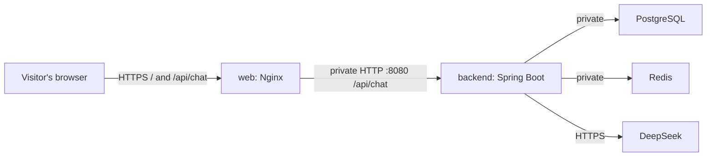

# Nginx web service

Eric requested the same production layout as his wiki: React and Spring Boot
remain separate services, with Nginx serving the website and forwarding its API
requests over a private connection. React still runs in the visitor's browser.
This replaces the earlier direct browser-to-public-backend deployment.



Only the web service needs a public domain. The `/api/chat` route remains
available to visitors through that domain; making the backend private does not
add authentication. Database, Redis, and storage endpoints are not published
through Nginx. New service routes require an explicit configuration change.

## Files and behavior

| File | Purpose |
| --- | --- |
| `web/Dockerfile` | Builds React with Node 24, then serves only the built files using the unprivileged Nginx stable Alpine image. Both base images are pinned by digest. |
| `web/.dockerignore` | Allows only build inputs and Nginx configuration; excludes local environment files, dependencies, and artifacts. |
| `web/nginx/nginx.conf` | Non-root runtime paths and access logs without request bodies, query strings, or authorization headers. |
| `web/nginx/default.conf.template` | Static hosting, API forwarding, web health endpoint, caching, and timeouts. |
| `web/nginx/15-api-resolvers.envsh` | Reads private DNS servers from `/etc/resolv.conf` and checks that `API_UPSTREAM` is an HTTP origin with a port. |
| `web/src/chat.ts` | Always POSTs to the relative URL `/api/chat`; no backend hostname is embedded in browser code. |
| `web/test/proxy.test.mjs` | Exercises the real production image with a temporary private HTTP upstream and isolated Docker network. |

Nginx serves `web/dist` at `/`, with `index.html` as the fallback for frontend
routes. Hashed `/assets/` files get a one-year cache lifetime; missing assets
return 404. HTML is revalidated. `/healthz` returns 200 from Nginx itself, even
while the backend is unavailable, so visitors can still load the website.

Both `/api` and `/api/*` are forwarded to the fixed `API_UPSTREAM`. Paths, query
strings, methods, JSON bodies, and upstream status codes are preserved. API
errors never fall through to `index.html`. Nginx uses a 128 KiB request body
limit; the backend still validates the 8,000-character message limit.

The upstream address is resolved at request time using the container's private
DNS, with a five-second cache. This allows web to start before backend and find
new backend addresses after replacement. A backend outage still produces an
error until it is reachable again. Nginx does not retry requests or cache API
replies, and proxy buffering is disabled.

The proxy has a five-second connection timeout and a 70-second read timeout.
The AI provider read timeout defaults to 60 seconds; the browser waits 65 seconds.
The wiki's shorter 15-second timeout is deliberately not reused for AI replies.
Forwarding preserves the incoming Host (including its port) and Origin headers.
Keep `CHAT_ALLOWED_ORIGINS` set to the public web origins on the backend.

No client-IP-based behavior is added. The proxy records its immediate peer in
`X-Forwarded-For`; Spring's default behavior does not trust forwarded headers.
Any future authentication/rate-limiting work must review the actual ingress chain.

## Runtime variables on web

| Variable | Default | Purpose |
| --- | --- | --- |
| `PORT` | `8080` | Nginx listening port. Railway's web domain must target this port. |
| `API_UPSTREAM` | `http://backend:8080` | Backend HTTP origin with its port. On Railway, use `http://${{backend.RAILWAY_PRIVATE_DOMAIN}}:8080`. No path, trailing slash, query, or credentials. |

These variables configure Nginx at container startup. Changing `API_UPSTREAM`
requires recreating/redeploying the web container, but does not require rebuilding
the JavaScript. Private DNS must be supplied by Railway or Docker; do not replace
it with a public resolver. `API_DNS_RESOLVERS` is generated automatically.

`VITE_API_BASE_URL` has been removed from the client implementation. Delete the
old Railway variable and deploy the new web image; already published old bundles
continue using their old URL until replaced. AI keys and database credentials
belong only on backend. No backend or provider secrets are needed for a web build.

## Run locally

From the repository root:

```sh
docker compose up --build -d
```

Open <http://localhost:5173>. Compose maps host `WEB_PORT` (default 5173) to Nginx
port 8080 and sets `API_UPSTREAM=http://backend:8080`. `/api/chat` goes through
the same production proxy used on Railway. Rebuild web after frontend or Nginx
source changes:

```sh
docker compose up -d --build web
```

For Vite live reload, optionally run the separate development profile:

```sh
docker compose --profile dev up -d web-dev
```

Open <http://localhost:5174> (override with `VITE_PORT`). The Vite development
server forwards `/api` using `BACKEND_PROXY_TARGET=http://backend:8080`. It is
not deployed to Railway. Host development with `cd web && npm run dev` still
works with a running backend; use another Vite port if 5173 is occupied by Nginx.

## Railway migration

See [Railway setup](railway.md) for the complete configuration. In brief:

1. Deploy the new web Dockerfile with root directory `/web`, Dockerfile path
   `Dockerfile`, and no build/start/pre-deploy overrides. The Dockerfile runs the
   frontend build and starts Nginx.
2. Set web `PORT=8080` and
   `API_UPSTREAM=http://${{backend.RAILWAY_PRIVATE_DOMAIN}}:8080`. Web and backend
   must share the same Railway project and environment. Remove `VITE_API_BASE_URL`.
3. Keep `erro.ink` attached to web, set its target port to 8080, and use `/healthz`
   as the web healthcheck path. The backend keeps `PORT=8080` and its existing
   infrastructure/provider variables.
4. Verify `https://erro.ink/healthz`, static assets, and a real chat reply through
   `https://erro.ink/api/chat`. Only then remove any backend public domain.

No extra proxy service or Namecheap DNS change is required. The private
web-to-backend connection avoids inter-service public egress. Traffic sent to
visitors and DeepSeek still uses the public network.

## Verification

Run the frontend checks from `web/` and the proxy suite from the repository root:

```sh
cd web
npm run lint
npm run build
cd ..
docker compose config --quiet
docker compose build web
node --test web/test/proxy.test.mjs
```

The proxy suite requires Node 24 and Docker. It uses the `erro-web` image (override
with `ERRO_WEB_IMAGE`) and `node:24-alpine` as a temporary HTTP fixture. It creates
only uniquely named test containers and a test network, and removes them afterward.
No provider key or paid request is used. It checks static files/cache behavior,
API path/body/header/status preservation, long replies, API errors, recovery after
a backend IP change without restarting Nginx, and website availability during API
downtime. These tests do not verify an actual Railway deployment or a live AI key.

### Results — 2026-10-04

- Frontend lint and production build passed. Compose configuration validated
  with and without the optional `dev` profile, and the web Docker image built.
- All six proxy regression tests passed, including a 16-second reply and a
  backend replacement with a different IP while Nginx kept running.
- The Compose backend verified PostgreSQL, Redis, and MinIO at startup. Both
  Nginx and the optional Vite proxy reached its real validation endpoint.
- A browser check exercised Nginx → Spring Boot → a temporary mock Responses
  provider. Sending, loading, formatted Markdown, safe errors, draft restoration,
  and retrying passed. All browser API requests stayed on the website origin.
- Desktop and mobile screenshots were reviewed; 390px and 320px widths had no
  page overflow. Refresh cleared messages, and the app created no browser
  storage or cookies. No browser JavaScript errors were recorded.
- The temporary mock services were removed. Railway deployment and a live
  DeepSeek request remain unverified; no real provider key was used.

Implementation references: [NGINX unprivileged image](https://github.com/nginx/docker-nginx-unprivileged),
[proxy directives](https://nginx.org/en/docs/http/ngx_http_proxy_module.html),
[DNS resolver](https://nginx.org/en/docs/http/ngx_http_core_module.html#resolver).
